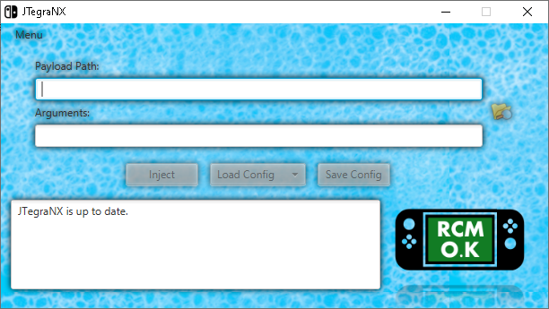

# JTegraNX - Another TegraRcmSmash GUI
A GUI for [TegraRcmSmash](https://github.com/rajkosto/TegraRcmSmash) written in Java. This program is intended to be an alternate option for injecting a payload if you can't get [TegraRcmGUI](https://github.com/eliboa/TegraRcmGUI) to work properly.

This program is bundled TegraRcmSmash and the files needed to mount SD cards using memloader. They are extracted in a separate folder upon launch so for organization's sake, I'd put the .jar file in it's own dedicated folder if I were you.

This program uses [usb4java](http://usb4java.org/index.html) to [detect the RCM device](./src/jtegranx/util/TegraRCM.java). Currently there is an issue where usb4java creates a temp directory that only contains libusb4java.dll, in normal circumstances this would be fine but it doesn't delete it when it's done with it and it always creates another one each time libusb is initialized (Thankfully only once each time this program is launched). I'm not sure why it does that and I will try to look for a fix on that.

Because this program was written in Java, you will need to have it installed on your computer, you can download Java [here](https://www.java.com/en/).

This program is only supported on Windows Operating Systems, sorry for any inconvenience.

## Features
- Payload injection (obviously)
- Custom arguments
- Auto-injection
- RCM status indicator with transparent images.
- Config system (similar to favorites in [TegraRcmGUI](https://github.com/eliboa/TegraRcmGUI))
- SD card mounting using [memloader](https://github.com/rajkosto/memloader) (Select "Load Config" to find it)
- Bundled payloads

## Usage
1. Choose payload or config
2. Inject

## Using configs
The new config system allows you to save what you entered in the "Payload Path" field and the "Arguments" field and load it again in another session.

### Loading a config:
Simply click on "Load Config" and JTegraNX will search the "configs" directory for any valid config files. Select the config you wish to use and click on "Load".

### Saving a config:
Simple click on "Save Config" and enter a name for the config, it will be saved in the "configs" directory.

## Bundled Payloads
For any bundled payloads, JTegraNX will download them automatically, place them in the "payloads" directory, generate a config for them, and check for updates on them each time the program is launched. If an update for a payload is found, it will be taken care of.

### Currently bundled payloads:
- [TegraExplorer](https://github.com/suchmememanyskill/TegraExplorer)
- [Lockpick_RCM](https://github.com/shchmue/Lockpick_RCM)

# Credits
- [suchmememanyskill](https://github.com/suchmememanyskill) for allowing me to include [TegraExplorer](https://github.com/suchmememanyskill/TegraExplorer).
- [rajkosto](https://github.com/rajkosto) for [memloader](https://github.com/rajkosto/memloader) and [TegraRcmSmash](https://github.com/rajkosto/TegraRcmSmash).
- [shchmue](https://github.com/shchmue) for [Lockpick_RCM](https://github.com/shchmue/Lockpick_RCM).
- [eliboa](https://github.com/eliboa) for the images from [TegraRcmGUI](https://github.com/eliboa/TegraRcmGUI).
