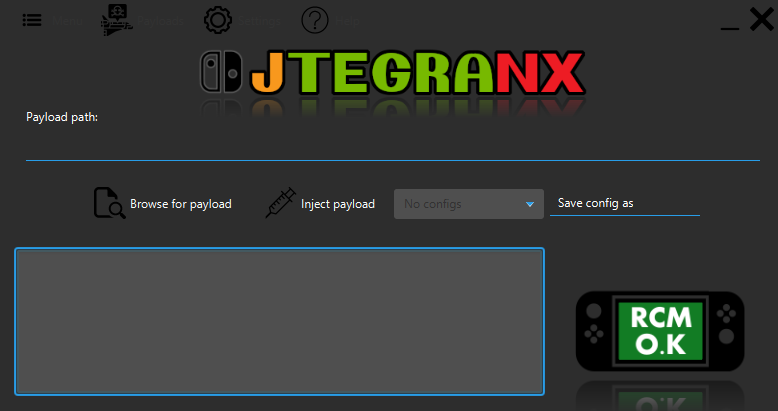

###

# JTegraNX - Another RCM payload injector

In order to run this program, you need Java 8 or higher installed on your computer. You can download Java [here](https://www.java.com/en/).

My builds of JTegraNX will not run on Java 11 or higher due to JavaFX not being included. Anyone who wishes to use JTegraNX on Java 11 or higher will need to build it from the source code.

JTegraNX is currently only supported on Windows and Linux, but I plan to add support for macOS.

## Preview

## Features
- RCM payload injection
- Auto-injection
- RCM status indicator with transparent images
- Config system (similar to favorites in [TegraRcmGUI](https://github.com/eliboa/TegraRcmGUI))
- Bundled payloads
- Tray icon with functionality
- SD card preparation
- APX driver detection/installation
- Portable mode

## Usage
1. Choose payload or config
2. Inject

## Linux support
Linux support has been added in v1.6.6, to use JTegraNX on Linux some preperation may be required.
- JTegraNX on Linux must either be run as root or with udev rules configured. To configure your udev rules, follow [this guide](https://nh-server.github.io/switch-guide/extras/adding_udev/).
- Payload injection on Linux requires the RCM device connecting to a port handled by xhci_hcd or a port with a patched EHCI driver.
  - My way of getting past this was creating an Ubuntu 21.04 VM in VMware with USB 3.1 enabled.

## Using configs
The config system allows you to save what you entered in the "Payload Path" field and load it again in another session.

### Loading a saved config:
Simply click on "Load Config" to reveal the config list, then select the config you wish to use.

### Saving a config:
Simple click on "Save Config", input a name for the config, and hit enter.

## Custom Settings
You can now customize JTegraNX's settings to your liking.
- You can now toggle auto-checking for JTegraNX updates.
- You can now toggle auto-checking for payload updates.
- You can now choose which payloads you want to include with JTegraNX.
- You can now toggle the tray icon being enabled or disabled.

## SD Card preparation
This new feature with JTegraNX will download all the basic requirements for getting your Switch ready for CFW and copy them to the specified output path.

## APX driver detection/installation
JTegraNX can detect if the APX driver is missing or incorrect, and if this is the case, you have the option to install it from there.

## Portable mode
JTegraNX's old behavior for handling data files has been re-implemented as a secondary option. Portable mode make it to where the "Payloads" directory and the main config file are created in the working directory of where the JAR is executed. You can switch between standard and portable mode using the Settings menu.

## Bundled Payloads
For any bundled payloads, JTegraNX will download them automatically, place them in the "Payloads" directory, and optionally check for updates on them each time the program is launched. If updates are enabled and an update for a payload is found, it will be taken care of.

### Currently bundled payloads:
- [fusee-primary](https://github.com/Atmosphere-NX/Atmosphere/releases)
- [Hekate](https://github.com/CTCaer/hekate)
- [Lockpick_RCM](https://github.com/shchmue/Lockpick_RCM)
- [Incognito_RCM](https://github.com/jimzrt/Incognito_RCM)
- [TegraExplorer](https://github.com/suchmememanyskill/TegraExplorer)

## Building from source
JTegraNX in it's current state is made of two projects, a Netbeans project that has all the Java bits and a Visual Studio 2019 solution that handles the native code.

Creating the Netbeans project isn't that complicated.
1. Create a new Netbeans Java project and name it JTegraNX.
2. Download [usb4java](https://github.com/usb4java/usb4java/releases), [Apache Commons IO](https://commons.apache.org/proper/commons-io/), and [GitHandler](https://github.com/dylwedma11748/GitHandler/releases).
3. Extract the usb4java and Apache Commons Lang archives.
4. On Netbeans, Projects -> JTegraNX -> Libraries, right-click and select "Add JAR/Folder" and add "usb4java-version.jar", "commons-lang3-version.jar", "libusb4java-version-win32-x86-64.jar", "libusb4java-version-linux-x86-64.jar" (Located where you extracted the usb4java archive), "commons-io-version.jar" (Located where you extracted the Apache Commons IO archive), and GitHandler.jar (Located wherever you saved GitHandler when you downloaded it).
5. Add the Java source files from this repository.
6. Now would be a good time to follow the instructions for the natives.
7. Do a test run to make sure everything is running correctly.
8. If everything is working properly build the project.
9. Download [jarsplice](http://www.java2s.com/Code/Jar/j/Downloadjarsplice040jar.htm) and use it to combine the main JAR file and the library JAR files into one executable JAR file.

To make changes to the UI, open MainUI.fxml using [Scene Builder](https://gluonhq.com/products/scene-builder/).

As for the Windows Native, this is where things may get complicated.
The libusbk-dev-kit is required for building this native. Download it [here](https://sourceforge.net/projects/libusbk/files/libusbK-release/3.0.7.0/).

1. Create a new Visual Studio Solution (Dynamic Link Library) and name it JTegraNX.
2. Open the project's properties -> C/C++ -> Precompiled headers, and set "Precompiled Header" to "Not Using Precompiled Headers" and clear the "Precompiled Header File" field.
3. In C/C++ -> General -> Additional Include Directories, add the include directories for JNI ((JDK Path)\include and (JDK Path\include\win32)) and libusbK (default is C:\libusbK-dev-kit\includes) and apply.
4. Switch platform to x64.
5. In Linker -> General -> Additional Library Directories, add C:\libusbK-dev-kit\bin\dll\amd64 if that's where you installed the libusbK-dev-kit and apply.
6. Switch platform to Win32.
7. In Linker -> General -> Additional Library Directories, add C:\libusbK-dev-kit\bin\lib\x86 if that's where you installed the libusbK-dev-kit and apply.
8. Switch platform to All Platforms.
9. In Linker -> Input -> Additional Dependencies, add SetupAPI.lib and libusbK.lib.
10. Delete "framework.h", "pch.h", "dllmain.ccp", and "pch.cpp" from the project.
11. Copy the Native's source files from this repository to the directory of the Visual Studio Project.
12. Copy libusbK.dll from the libusbK-dev-kit to the directory of the Visual Studio Project.
13. In the Solution Explorer, right click on Header Files and select Add -> Existing Item... and add all the header files.
14. In the Solution Explorer, right click on Source Files and select Add -> Existing Item... and add all the source files.
15. Build the Release configuration corresponding to your system's OS architecture.
16. Copy the compiled x86 native to src\windows\natives and rename it to "JTegraNX_x86.dll".
17. Copy the compiled x64 native to src\windows\natives and rename it to "JTegraNX_x64.dll".

The Linux Native isn't so complicated.
1. Download the source code from the repository.
2. Edit the makefile to have the proper paths for JNI.
3. run make.
4. Copy the compiled x86 native to src\linux\natives and rename it to "JTegraNX_x86.so".
5. Copy the compiled x64 native to src\linux\natives and rename it to "JTegraNX_x64.so".

# Credits
- [suchmememanyskill](https://github.com/suchmememanyskill) for [TegraExplorer](https://github.com/suchmememanyskill/TegraExplorer).
- [rajkosto](https://github.com/rajkosto) for [memloader](https://github.com/rajkosto/memloader) and [TegraRcmSmash](https://github.com/rajkosto/TegraRcmSmash) (No longer being used in v1.6+).
- [shchmue](https://github.com/shchmue) for [Lockpick_RCM](https://github.com/shchmue/Lockpick_RCM).
- [eliboa](https://github.com/eliboa) for the images from [TegraRcmGUI](https://github.com/eliboa/TegraRcmGUI).
- The creators of Atmosphère for [fusee-primary](https://github.com/Atmosphere-NX/Atmosphere/releases).
- [CTCaer](https://github.com/CTCaer) for [Hekate](https://github.com/CTCaer/hekate).
- [jimzrt](https://github.com/jimzrt) for [Incognito_RCM](https://github.com/jimzrt/Incognito_RCM)
