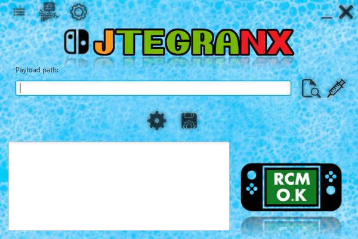

# JTegraNX - Another RCM payload injector

In order to run this program, you need Java installed on your computer. You can download Java [here](https://www.java.com/en/).

JTegraNX is only supported on Windows.

## Features
- RCM payload injection
- Auto-injection
- RCM status indicator with transparent images
- Config system (similar to favorites in [TegraRcmGUI](https://github.com/eliboa/TegraRcmGUI))
- Bundled payloads
- Tray icon with functionality
- SD card preparation
- APX driver detection/installation

## Usage
1. Choose payload or config
2. Inject

## Using configs
The config system allows you to save what you entered in the "Payload Path" field and load it again in another session.

### Loading a saved config:
Simply click on "Load Config" to reveal the config list, then select the config you wish to use.

### Saving a config:
Simple click on "Save Config", input a name for the config and hit enter.

## Custom Settings
You can now customize JTegraNX's settings to your liking.
- You can now toggle auto-checking for JTegraNX updates.
- You can now toggle auto-checking for payload updates.
- You can now choose which payloads you want to include with JTegraNX.
- You can now toggle the tray icon being enabled or disabled.

## SD Card preparation
This new feature with JTegraNX will download all the basic requirements for getting your Switch ready for CFW and copy them to the specified output path.

## APX driver detection/installation
JTegraNX can detect if the APX driver is missing or incorrect, and if this is the case, you have the option to install it from there.

## Bundled Payloads
For any bundled payloads, JTegraNX will download them automatically, place them in the "payloads" directory, and optionaly check for updates on them each time the program is launched. If updates are enabled and an update for a payload is found, it will be taken care of.

### Currently bundled payloads:
- [TegraExplorer](https://github.com/suchmememanyskill/TegraExplorer)
- [Lockpick_RCM](https://github.com/shchmue/Lockpick_RCM)
- [fusee-primary](https://github.com/Atmosphere-NX/Atmosphere/releases)
- [Hekate](https://github.com/CTCaer/hekate)

# Credits
- [suchmememanyskill](https://github.com/suchmememanyskill) for allowing me to include [TegraExplorer](https://github.com/suchmememanyskill/TegraExplorer) and for [this guide](https://nh-server.github.io/switch-guide/user_guide/emummc/sd_preparation/) that the SD preperation feature relies on.
- [rajkosto](https://github.com/rajkosto) for [memloader](https://github.com/rajkosto/memloader) and [TegraRcmSmash](https://github.com/rajkosto/TegraRcmSmash) (No longer being used in v1.6+).
- [shchmue](https://github.com/shchmue) for [Lockpick_RCM](https://github.com/shchmue/Lockpick_RCM).
- [eliboa](https://github.com/eliboa) for the images from [TegraRcmGUI](https://github.com/eliboa/TegraRcmGUI).
- The creators of Atmosphère for [fusee-primary](https://github.com/Atmosphere-NX/Atmosphere/releases).
- [CTCaer](https://github.com/CTCaer) for [Hekate](https://github.com/CTCaer/hekate).
